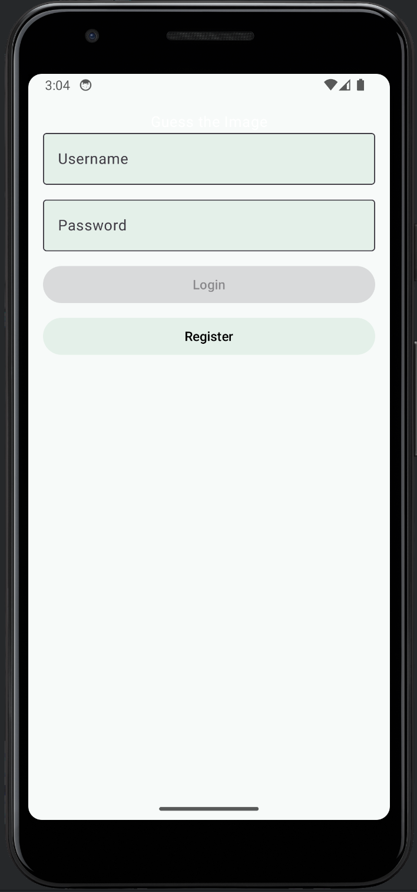
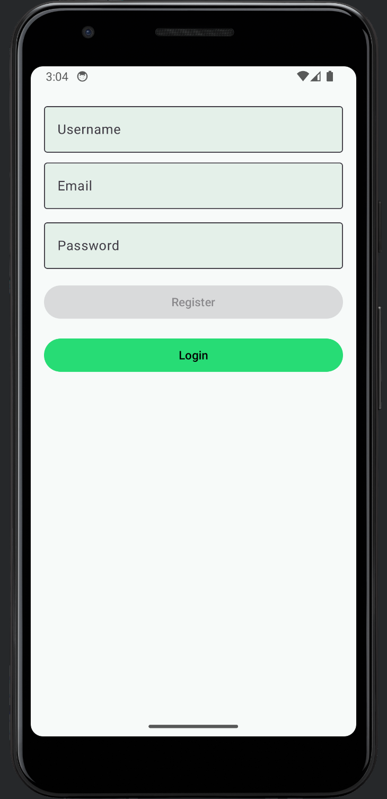
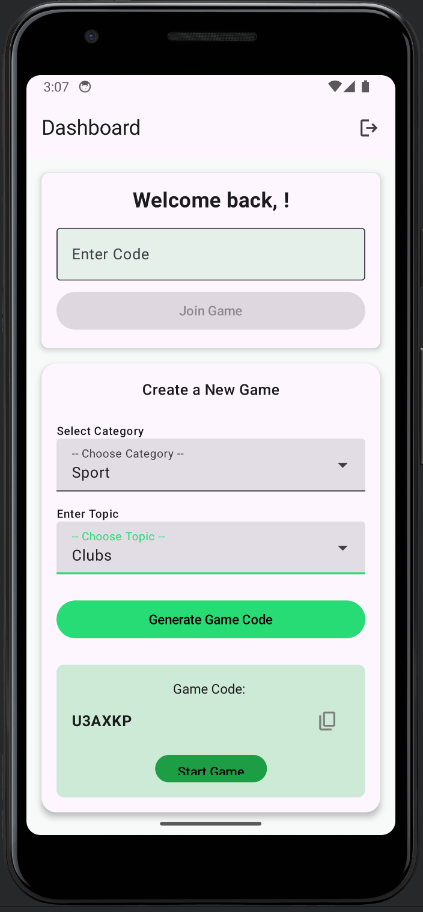
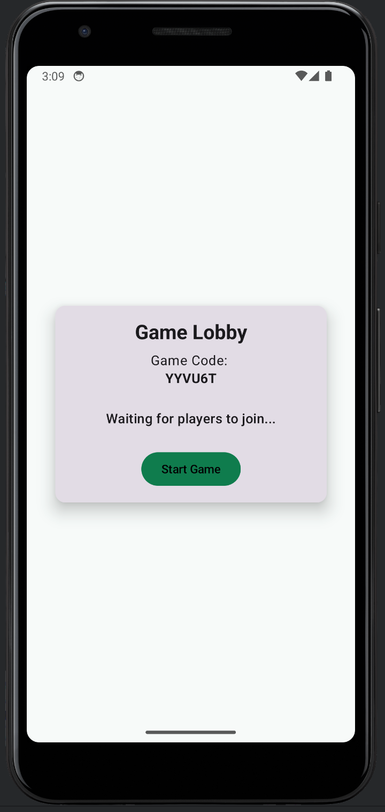
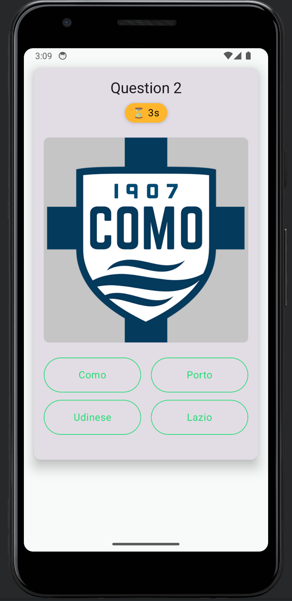
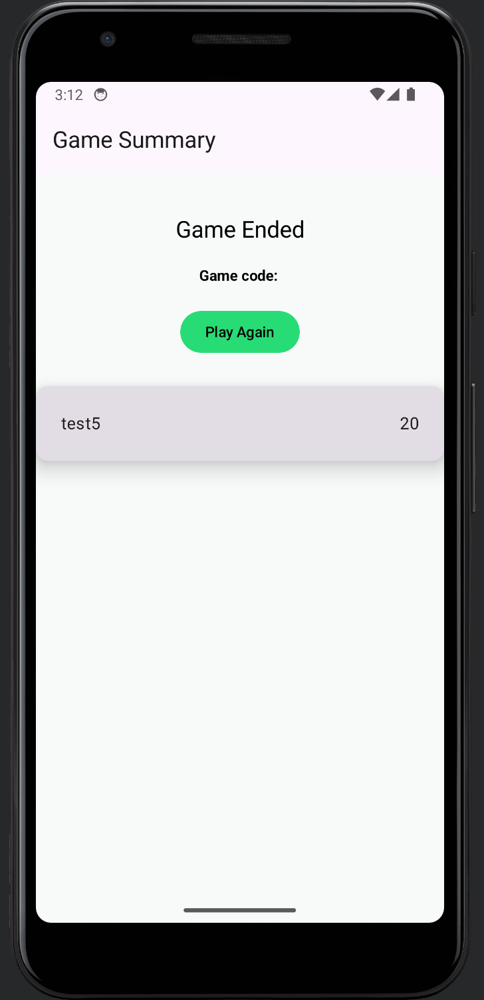

# Guess App Mobile (Android)(WIP)

This is the companion Android application for [Guess Web](https://github.com/olajhidey/guess-app-web) and [Guess Admin](https://github.com/olajhidey/guess-admin).
Quiz Arena is a real-time multiplayer quiz game where users can create or join game rooms, answer questions with images, and compete with others live. Built using **Jetpack Compose**, this app delivers an engaging, modern UI and interactive gameplay experience.

---
## 🔗 Companion Applications

Guess App relies on two key backend and admin tools to deliver its functionality:

### 🌐 [Guess-App-Web (Host Engine)](https://github.com/olajhidey/guess-app-web)
- A web-based host engine responsible for managing game sessions, player connections, and real-time communication using **Socket.IO**.
- Hosts the game logic and synchronizes state across mobile players in real-time.
- Handles game code generation, player joining, and broadcasting questions and results.

### 🛠️ [Guess-App-Admin (Admin Portal)](https://github.com/olajhidey/guess-admin)
- A web-based administrative dashboard where authenticated users can:
   - ✅ Create and manage **categories**, **topics**, and **questions**.
   - 📊 Review **game summaries**, including scores, participation, and question analytics.
   - 🧠 Upload question images and define correct answers.
- Enables dynamic quiz content management without modifying the mobile app.

> 🚨 **Note**: These two companion apps must be set up and running for the mobile app to function properly.

---

## 🧩 Features

- 👤 **User Roles**: Host or Join a game
- 🕹️ **Game Creation**: Create new games with category & topic selection
- 🎮 **Game Lobby**: Real-time lobby updates showing joined players
- 🖼️ **Question Playground**: Image-based questions with four options
- ✅ **Answer Feedback**: Immediate feedback on correct/incorrect answers
- ⏳ **Timers**: Countdown for each question and game lobby
- 📋 **Game Code Sharing**: Copy game code to clipboard for inviting others

## 🛠️ Tech Stack

- **Jetpack Compose** – Declarative UI toolkit
- **Kotlin** – Modern Android development language
- **ViewModel + StateFlow** – State management
- **Navigation Component** – For in-app navigation
- **Backend API** – For real-time game data (assumed based on feature set)
- **Coil** – Image loading for question images
- **Socket.io** – Real-time communication for game updates

## 🚀 Getting Started

### Prerequisites

- Android Studio
- Kotlin 1.9+
- JDK 17+
- Internet connection for API calls

---

## 🧪 How to Run the App

1. **Clone the repository**:
   ```bash
   git clone https://github.com/olajhidey/guess-app-android.git
   cd guess-app-android
   ```

## 🧭 App Flow
1. Create/Register User. This calls the [Guess Admin Backend API](https://github.com/olajhidey/guess-admin) 
2. Login in the newly created User 
3. ### Create Game Screen
   - Select a category and topic. 
   - Tap “Generate Game Code”. 
   - Game code is displayed and can be copied. 
   - Host can then start the game once players have joined.
4.  ### Lobby Screen
   - Shows game code and list of joined players.
   - Host can tap “Start Game” to begin. 
   - Players wait for the host to start.
5. ### Playground (Game) Screen
   - Displays question with image and 4 options.
   - User taps an answer and gets instant feedback (correct/wrong).
   - Countdown timer for each question.

## 📸 Screenshots



